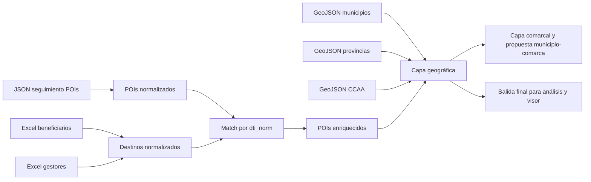

# Modelo relacional y flujo PID

Este documento resume cómo se conectan los datos del proyecto:

- destinos
- POIs
- geografía
- fuentes Excel y JSON

La idea es evitar mezclar conceptos distintos y mantener una capa limpia para análisis y visor.

## Capas principales

### 1) Capa de destino

Representa el destino turístico como unidad lógica de negocio.

Un destino puede ser:

- un municipio
- una comarca
- una diputación
- un consell
- una comunidad autónoma

La clave operativa para el match es `nombre_destino_norm`.

### 2) Capa de POIs

Cada POI procede del JSON de seguimiento y se normaliza a una fila.

La clave operativa para el enlace con destino es `dti_norm`.

### 3) Capa geográfica

La jerarquía geográfica canónica es:

- municipio
- provincia
- comunidad autónoma

El municipio es la unidad mínima de análisis territorial.

### 4) Capa comarcal

La comarca se modela como capa de referencia propia y como relación inferida con municipios.

Se generan dos salidas de trabajo:

- `comarcas_lite.csv`: inventario de comarcas detectadas como destinos o entidades comarcales
- `municipio_comarca_propuesta.csv`: propuesta de relación municipio-comarca derivada del audit y de las menciones textuales

Además:

- `comarcas_propuesta.csv` resume la propuesta por comarca

Estas tablas son válidas para trabajo interno y revisión experta posterior.

En el fichero `municipio_comarca_propuesta.csv`, cada comarca puede aparecer con varios municipios propuestos. El campo `rank_en_comarca` ordena las coincidencias dentro de cada comarca y `confianza` reparte el peso relativo entre las menciones detectadas.

### Pendientes de validación experta

Aunque la propuesta se considera operativa, conviene revisar con expertos estos casos:

- comarcas con nombres muy parecidos a municipios
- municipios que aparecen por simple coincidencia textual en descripciones largas
- entidades supramunicipales que el audit trata como comarca pero que en realidad funcionan como consell, mancomunidad o federación
- referencias sin provincia explícita en las fuentes

Campos a vigilar:

- `nombre_comarca`
- `nombre_municipio`
- `peso_mencion`
- `confianza`
- `tipo_referencia`

Regla de uso:

- si la revisión experta confirma la relación, el estado pasa a `validado`
- si la rechaza, el registro se corrige o se elimina
- mientras tanto, el estado permanece como `propuesto`

## Relaciones clave

### Destino -> Geografía

Un destino puede tener uno o varios niveles territoriales asociados:

- municipio
- provincia
- comunidad autónoma

Sin embargo, no todos los tipos de entidad tienen código INE propio.

Casos especiales:

- comarca: normalmente no tiene código INE
- diputación: puede asimilarse a provincia en algunos casos
- consell: puede asimilarse a provincia o a entidad supramunicipal, según el contexto

### POI -> Destino

El POI se vincula al destino por el campo:

- `dti`

Tras normalización:

- `dti_norm`

Ese valor se cruza con:

- `nombre_destino_norm`

### POI -> Geografía

Una vez vinculado al destino, el POI se enriquece con:

- `codigo_ine`
- `nombre_municipio`
- `codigo_provincia`
- `nombre_provincia`
- `codigo_ccaa`
- `nombre_ccaa`

Si el punto trae coordenadas, el match geográfico se resuelve por geometría.
Si no, el municipio se intenta inferir con la lógica espacial disponible.

## Diagrama

## Flujo extremo a extremo

### Entrada

- Excels de beneficiarios y gestores
- JSON de seguimiento
- capas geográficas fuente

### Normalización

El script:

- detecta columnas y hojas por estructura
- genera CSV limpios
- normaliza nombres
- conserva trazabilidad útil

### Enriquecimiento

Después:

- cruza POIs con destinos por nombre normalizado
- asigna municipio, provincia y CCAA
- marca el estado de match geográfico

### Salida

Se generan:

- `normalized/destinos/*`
- `normalized/pois/*`
- `normalized/geo/*`
- `normalized/geo/comarcas_lite.csv`
- `normalized/geo/municipio_comarca_propuesta.csv`
- `normalized/geo/comarcas_propuesta.csv`

Inventario resumido:

- [inventario-final-salidas.md](C:/Users/dcollazos.SEGITTUR/Documents/ChatGPT/bdashboard/docs/inventario-final-salidas.md)

## Criterio de diseño

La capa limpia no debe duplicar información que se pueda derivar.

Por eso:

- los nombres se conservan para lectura
- los códigos se usan para cruce y control
- los campos libres se resumen cuando aportan valor
- los datos sin uso operativo se dejan en `raw`

## Resumen funcional

El modelo responde a dos preguntas distintas:

1. ¿Qué destino es?
2. ¿Dónde cae geográficamente?

La primera se resuelve con destino y `dti`.
La segunda se resuelve con geometría y jerarquía territorial.
